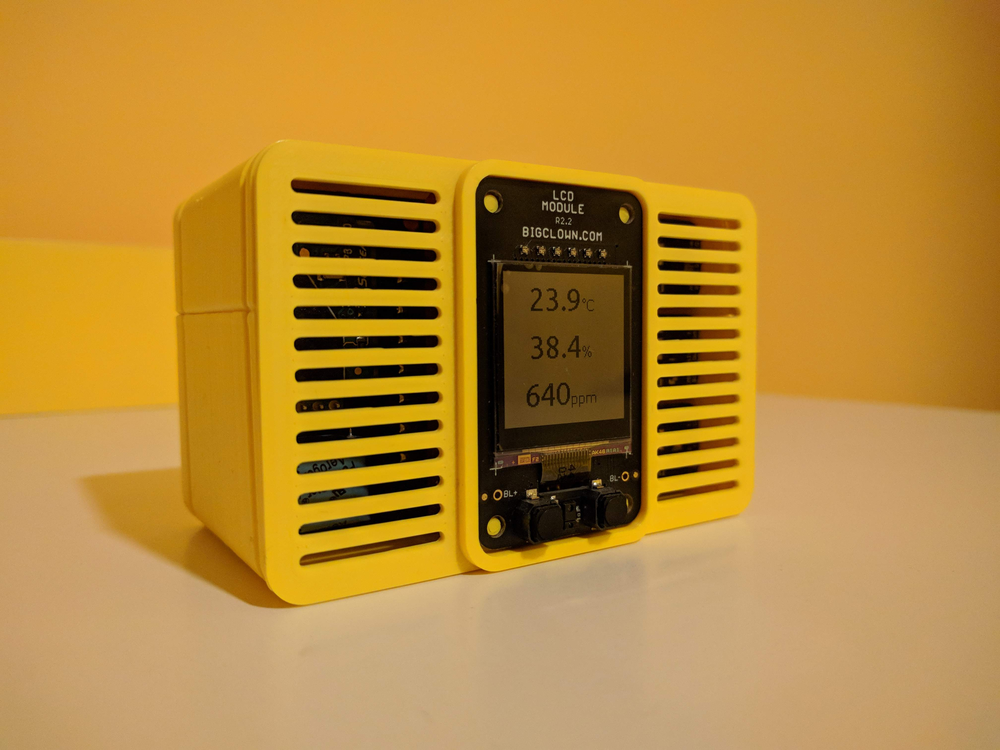

# Firmware for BigClown Air Quality Monitor

## Hardware

The following hardware components are used for this project:

* **[Temperature Tag](https://shop.bigclown.com/temperature-tag)**
* **[Humidity Tag](https://shop.bigclown.com/humidity-tag)**
* **[Lux Meter Tag](https://shop.bigclown.com/lux-meter-tag)**
* **[LCD Module - BG](https://shop.bigclown.com/lcd-module-bg)**
* **[Core Module](https://shop.bigclown.com/core-module)**
* **[CO2 Module](https://shop.bigclown.com/co2-module)**
* **[Battery Module](https://shop.bigclown.com/battery-module)**

## Buttons on LCD Module

* Both buttons are wired to boot button on Core Module, so they have same functionality:
  * Press to force measure all values
  * Hold to activate CO2 Module calibration
